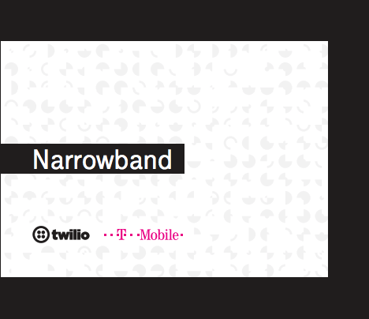
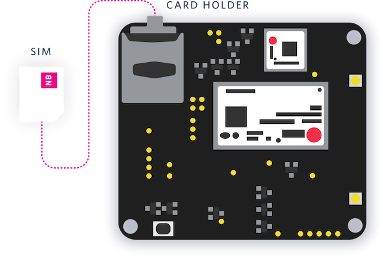
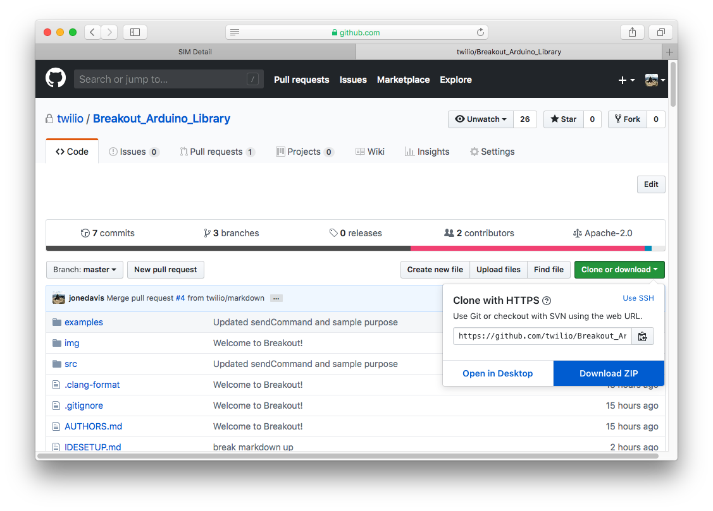

# Twilio Breakout SDK Environment Setup
This page documents how to get started using the Breakout SDK and what it provides. Today, the Breakout SDK is built for the STM32F405RG MCU and U-Blox Sara-N410 cellular module in mind. This specific Developer Board was provided in Twilio's Alfa Developer Kit and distributed to [SIGNAL 2018](https://www.twilio.com/signal) attendees, and it came with Grove sensors – humidity, light, and ultrasonic.

## Alfa Developer Kit
<p align="center">
  
</p>


### Alfa Developer Kit contents
- Programmable Wireless Narrowband SIM
- Alfa Developer Board
- LTE antenna
- GPS antenna
- 3 Grove sensors:
    1. Button
    2. Ultrasonic
    3. Temperature/Humidity
- Lithium battery
- Micro-USB cable

## Requirements
The following items are required to use Breakout SDK:

- Alfa Development Kit
-  [Arduino IDE 1.8.7+](https://www.arduino.cc/en/Main/Software)
- dfu-util

## Installing the Narrowband SIM and the LTE Antenna into the Developer Board
1.  [Register the Narrowband SIM](https://www.twilio.com/console/wireless/sims/register) in the Programmable Wireless Console
2. Insert the **smallest** form factor of the Narrowband SIM in the **bottom** of the **two** slots available on the Developer Board



> The smallest form factor of a SIM is the Nano (4FF) SIM size. The top slot is a Micro-SD card slot. If you insert the Narrowband SIM in the top slow, gently pry it out with needle-nose pliers.

3. Connect the LTE Antenna to the LTE pin located on the **bottom** of the board.

## Set up your development environment
The following steps will guide you from downloading the Arduino IDE to installing sample applications on your Developer board.

### Arduino IDE Installation
1. Download [Arduino IDE 1.8.7+](https://www.arduino.cc/en/Main/Software)

### dfu-util Installation
##### OSX

The following step is required for OSX:

1. Install Homebrew by typing the following in a Terminal:
``` /usr/bin/ruby -e "$(curl -fsSL https://raw.githubusercontent.com/Homebrew/install/master/install)" ```
2. Install dfu-util using Homebrew by typing the following in a Terminal:
``` brew install dfu-util libusb```

> **Note:** Use dfu-util 0.9 or greater if available. Check dfu-util version with ```brew info dfu-util```

##### Windows

The follow steps are required for Windows:
1.  [Install USB Drivers](http://wiki.seeedstudio.com/Wio_LTE_Cat_M1_NB-IoT_Tracker/#install-usb-driver)

### Arduino IDE Developer Board Installation
1. Insert the Micro-USB cable into the Developer Board
2. Insert the other end of the USB cable in your computer
3. Open Arduino IDE
4. Click Arduino > Preferences
5. Copy the following URL into the Additional Boards Manager URLs field:
```https://raw.githubusercontent.com/Seeed-Studio/Seeed_Platform/master/package_seeeduino_boards_index.json```
6. Click OK
7. Click Tools > Boards > Boards Manager
8. Type "Seeed" into the search field
9. Select the Seeed STM32F4 Boards version 1.2.3+
> See [#2 in known limitations and workaround](#limitations-and-workarounds) if you are not using version 1.2.3 or greater.
10. Click Install
11. Close the Boards Manager window
12. Click Tools > Boards > Wio Tracker LTE
13. Click Tools > Port > **{Your Modem Port Here}**
    * OSX: /dev/{cu|tty}.usbmodem{XXXX}
    * Linux: /dev/ttyACM{X}
    * Windows: COM{X}

#### Arduino > Preferences
  

#### Tools > Boards > Boards Manager > Seeed STM32F4 Board
  

### Breakout SDK Installation
1. Click the green "Clone or download" button at the top right handside of this repository
2. Click the [Download as ZIP file](https://github.com/twilio/Breakout_Arduino_Library/archive/master.zip) button
3. Make note of the download location
4. Open Arduino IDE
5. Select Sketch > Include Library > Add .ZIP Library and select the .zip file downloaded
6. Restart Arduino IDE

  

### Updating Breakout SDK on your local machine
The library will now be present for Arduino IDE to use. To update the library:

1. Delete the library from your Arduino directory
    * You can find the library to delete in your ```Arduino/libraries``` directory
    * OSX: in ~/Documents/Arduino/libraries
2. Follow the steps in the [Breakout SDK Installation](#Breakout-SDK-Installation) section above

>  **Tip:** An alternative to downloading the library as a ZIP is to check the library out using ```git``` in the Arduino/libraries directory, or symlink the locally-checked out copy there.

## Flash the Developer Board with sample applications
1. Open Arduino IDE
2. Click File > examples and navigate to the Breakout library examples
3. Select an example from File > Examples > Breakout SDK > Sensors
  1. Search for `psk_key`
  2. Insert your PSK in place of `00112233445566778899aabbccddeeff`
  3. You can find your PSK in the under your [Narrowband SIM Resource](https://twilio.com/console/wireless/sims)
> **Note:** The example ino files are readonly. Save your changes to a new location.
4. Enable Bootloader mode on the Developer Board: 
	1. Press and hold the **BOOT0** button underneath the Developer Board
	2. Press and hold the **RST** on the top of the Developer Board
	3. Release the **RST** on the top of the Developer Board
	4. Release the **BOOT0** button to enable Bootloader mode
5. Click Sketch > Upload to upload the example to the Developer Board
  * Do not click `Upload Using Programmer`
6. Click the RST button when the sketch has finished uploading
7. Click Tools > Port > **{Your Modem Port Here}**
    * OSX: /dev/{cu|tty}.usbmodem{XXXX}
    * Linux: /dev/ttyACM{X}
    * Windows: COM{X}
8. Click Tools > Serial Monitor
9. Monitor the output of the board in the Serial Monitor window

> When the board is in Bootloader mode the serial port won't be initialized and not available to monitor.

Receiving the output ```WARNING: Category 'Device' in library Wio LTE Arduino Library is not valid. Setting to 'Uncategorized'``` See known #4 under [Limitations and Workarounds](#limitations-and-workarounds) below.

**Note** Connecting to the network for the first time can take a minute or two. If the light doesn't go blue, try another location. You may not have cell coverage in your current location.

## Developer Board LEDs
The LEDs on the Developer Board are set to function as the following:
- Red CHG LED - Lights up based on the battery charging level. 
- Yellow Status LED - lights up when the modem module is power on.
- Blue Network LED - lights up when the modem module is successfully registered to the mobile NB-IoT network.
- Red RST LED - lights up during the reset procedure. To place the module in firmware flashing mode, press the BOOT0 switch on the board when this LED lights up.
- WS2812 RGB LED - available for your application and is used in the briefly in the examples to indicate the status of the Breakout SDK.

> Note that the lithium battery is recommended to be plugged in at all times, especially if your USB power source does not provide sufficient power for the board at peak levels.

## Limitations and Workarounds
1. Receiving the output ```WARNING: Category 'Device' in library Wio LTE Arduino Library is not valid. Setting to 'Uncategorized'``` in Arduino IDE.
    *  **Problem:** Incorrect version of dfu-util. Using 0.8 or lower.
    *  **Solution:** Update dfu-util to 0.9+
       * OSX: Type the following in a Terminal: ``brew install dfu-util``
 2. Unable to remove lithium battery from Developer Board.
    *  **Problem:** JST pings lock lithium battery into place.
    *  **Solution:**  If the battery is pushed in a touch too far, it locks. Lift the pins from the JST connector and pull on the lithium battery cable. The JST connector has tabs that dig in and are not meant to be disconnected again.
  3. `No DFU capable USB device available`
      *  **Problem:** Unable to upload firmware. Device is not in DFU mode.
      ```
      DFU begin
      dfu-util 0.8

      Copyright 2005-2009 Weston Schmidt, Harald Welte and OpenMoko Inc.
      Copyright 2010-2014 Tormod Volden and Stefan Schmidt
      This program is Free Software and has ABSOLUTELY NO WARRANTY
      Please report bugs to http://sourceforge.net/p/dfu-util/tickets/

      dfu-util: Invalid DFU suffix signature
      dfu-util: A valid DFU suffix will be required in a future dfu-util release!!!
      dfu-util: No DFU capable USB device available
      DFU end
      ```
      *  **Solution:** [Put Developer Board in DFU mode.](#flash-the-developer-board-with-sample-applications)
